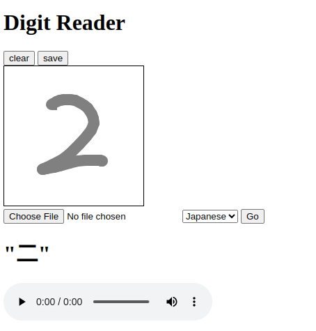

# Digit Reader

This is a demo web app for hand-writing digit reading

# Archtecture


# Get started

You need to run a [k3s.io](https://k3s.io) cluster on your machine.

```
cd k8s/

kubectl apply -f apigateway.yaml
kubectl apply -f ocr.yaml
kubectl apply -f translator.yaml
kubectl apply -f tts.yaml
```

Now start the front-end project
```
cd frontend/
npm run dev
```

Open your browser at [http://localhost:5173](http://localhost:5173)

